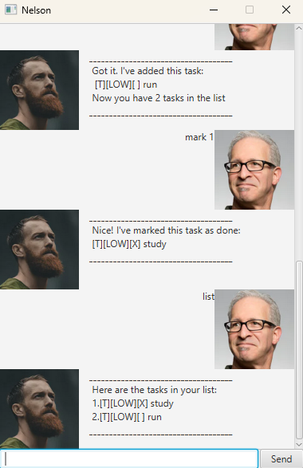

# Nelson User Guide

## Introduction
Nelson is a simple chatbot that helps you manage tasks.  
You can add tasks, set deadlines, mark them as done, delete them, and view your task list 
all from a single text-based interface.

## Quick Start 
1. Ensure you have **java 17** or above installed on your computer 
2. Open a terminal, enter command: "./gradlew clean build"
3. Then enter command: "./gradlew run"
4> Type commands into console to interact with Nelson. 

## Adding deadlines

Add deadlines to tasks
Tasks can only be marked with a deadline by labelling them as "deadline". 

Format: Deadline Description /by Date
Date to be in format of YYYY-MM-DD

**Example**
Deadline study /by 2025-09-20 

Nelson Chatbot will input and label this deadline task into data base
and print out the acknowledgement as well as number of tasks in list 

**Expected outcome:**
Got it. I've added this task:
[D][ ] study (by: Sep 20 2025)
Now you have 1 task in the list.

## Adding Tasks with no date

To add tasks with no date, label them as todo

Format: Todo Description 

**Example** 
Todo study 

Nelson Chatbot will input and label this todo task into data base
and print out the acknowledgement as well as number of tasks in list 

**Expected outcome:**
Got it. I've added this task:
[T][ ] study 
Now you have 1 task in the list.

## Exiting the GUI

Exits the GUI and terminates Nelson Bot

Format: Bye

**Example**
Bye

Nelson Chatbot will print out goodbye message and terminate shortly after 

**Expected outcome** 
Bye. Hope to see you again soon!